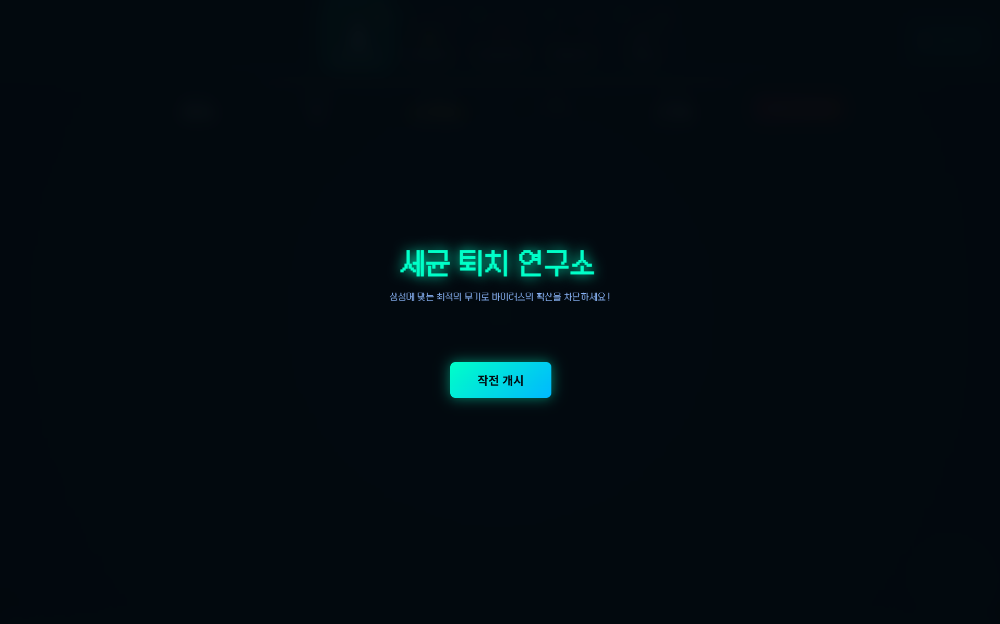
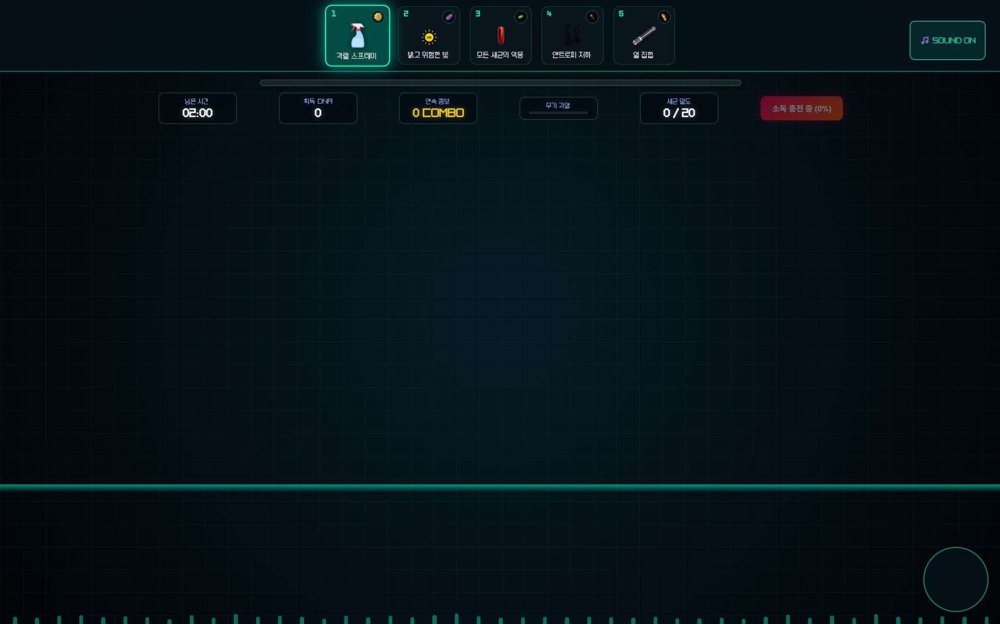

# anti-biotics

- 제작 기간 :
3일

- 제작 인원:
개인 프로젝트

- 배포 URL :
https://cksckscks1008.github.io/anti-biotics/

## 프로젝트 소개
세균들에게 경각심을 가지고 명확한 소독법, 예방법을 알리기위하여 개발한 5가지 종류의 세균을 각 세균에 효과적인 소독법으로 잡는 게임형식의 웹페이지.

## 사용기술
- html
- css
- js
- figma
- Github Pages
- Github

## AI활용 및 검토 과정
- 사용 AI : codex
- AI에게 맡긴 작업 : 초기 프로젝트 구조 설계 및 주요 게임 로직(세균 출현, 클릭 이벤트, 스코어링 등)의 기본 프레임워크 작성, 소독 기능 및 타이머 연동에 필요한 JS 코드 초안 생성

- 직접 수정 및 개선한 내용 : 디자인 및 UI/UX 커스텀: Figma로 제작한 디자인 시스템에 맞춰 레이아웃과 스타일(CSS)을 세밀하게 조정

- 게임 밸런싱: 세균 등장 주기, 소독 도구별 상성 및 데미지 값, 타이머 속도 등 게임의 재미와 직관성을 높이기 위해 매개변수(Parameter)를 직접 테스트하며 조정

- 예외 처리: 브라우저 보안 정책(Autoplay Policy)에 따른 오디오 재생 실패 오작동 해결 및 이벤트 리스너 최적화

## 주요화면 및 구현 내용

> 위 게임 화면을 클릭하면 플레이 영상이 열립니다. (MP4, 9.34MB)

- 구현 내용 : 세균 소독 미니게임 로직: 총 5가지 종류의 세균이 무작위로 등장하며, 각 세균의 특징에 맞는 올바른 소독법(도구)을 선택하여 처치하는 인터랙티브 웹 게임 구현
- 오디오 시스템 구축: 게임의 몰입감을 높이기 위해 배경음악(BGM) 및 효과음 적용
- 어려웠던 점 : 
    - 문제: 웹페이지 로드 시 배경음악(BGM)이 자동으로 재생되지 않거나, 브라우저 콘솔에 오디오 재생 관련 에러가 발생함.

    - 원인 분석: 최신 웹 브라우저의 Autoplay 정책(사용자 경험 및 데이터 보호를 위해 최소 1회 이상의 사용자 인터랙션이 없으면 오디오 자동 재생을 차단하는 보안 정책)으로 인해 발생함을 확인.

    - 해결 방법: 게임 시작 화면(Start 버튼)을 배치하여, 사용자가 '게임 시작' 클릭 이벤트를 발생시키는 시점에 BGM이 자연스럽게 재생되도록 코드 흐름을 개선함. 이를 통해 브라우저 보안 정책을 준수하면서도 자연스러운 UX를 제공할 수 있게 됨.

## 프로젝트 회고
- 프로젝트를 통해 반응형 웹을 제작하는 방법과 배포하는법 등을 배웠다
- 다음 프로젝트에서는 좀더 기능적인 면에 집중해서 내가 구현하고싶은 기능들을 구현하고싶다.
